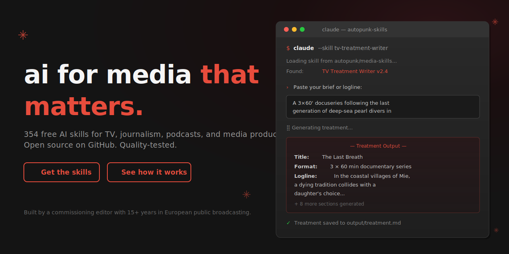

  

---

## What Is This?

This is a free collection of **Claude skills** — ready-to-use prompts and instructions that turn Claude into a specialist for media production work.

Think of each skill as hiring an expert collaborator for one specific task: writing a pitch treatment, generating SEO-optimized YouTube titles, cleaning up an interview transcript, or building a cinematic image prompt from scratch.

**No coding required. No technical knowledge needed.** Pick a skill, give Claude what it needs, and get professional-grade output.

---

## Who Is This For?

- **TV documentary producers** — development, pre-production, scripting, post-production, localization, business
- **Magazine journalists** — story ideation, writing, editing, investigation, fact-checking, legal
- **YouTube creators** — pre-production, scripting, post-production, channel strategy, business, analytics
- **Podcast producers** — episode planning, scripting, show notes, sponsorship
- **Visual content creators** — image prompts for Midjourney, Flux, and art direction workflows
- **Media business** — pitching broadcasters, fundraising, distribution, rights clearance
- **Social media managers** — captions, threads, carousels, platform strategy
- **Radio journalists and producers** — bulletins, packages, two-ways, running orders, broadcaster pitches
- **Newsletter writers** — editions, subject lines, subscriber growth, paid conversions, sponsorship
- **PR and communications professionals** — press releases, crisis statements, spokesperson briefs, op-eds
- **Screenwriters** — treatments, beat sheets, scene writing, script notes, coverage

---

## Quick Start

**Copy this into Claude right now and see what you get.**

This example uses the `hook-generator` skill from `skills/youtube/pre-production/hook-generator.md`.

### What you paste into Claude:

```
You are a YouTube hook specialist. Your job is to write the first 15–30 seconds
of a YouTube video script — the hook that stops the scroll and forces the viewer
to keep watching.

My video is about: the hidden reason most people fail at learning a new language
as an adult — and why the standard advice about "immersion" is scientifically wrong.

Target audience: adults aged 28–45 who have tried and failed to learn a language
before and feel frustrated with their own progress.

Tone: direct, slightly provocative, backed by science — not motivational-speaker energy.

Write 3 alternative hooks. For each: write the full script, then a one-line note
explaining the psychological mechanism it uses.
```

### What Claude gives you:

---

**Hook A — The Broken Promise**

"Every language app, every tutor, every Reddit thread told you the same thing: immerse yourself. Surround yourself with the language. Just listen. Just watch. Just live it.

You did that. For months. And you still can't hold a conversation.

Here's what they didn't tell you — and what the research has known since 1985."

*Mechanism: Validates the viewer's failure as a systemic problem, not personal inadequacy. Creates urgency to hear the explanation.*

---

**Hook B — The Number**

"94% of adult language learners plateau within six months. Not because they quit. Because they're doing the one thing every expert recommends — and it is actively working against how the adult brain acquires language.

The science on this is twenty years old. Nobody taught it to you."

*Mechanism: Specific statistic creates credibility shock. "Nobody taught you" frames the video as access to suppressed information.*

---

**Hook C — The Confession**

"I spent three years living in a country where I didn't speak the language. By the end, I could order coffee and ask for directions. That's it. Three years.

Turns out, immersion without one specific ingredient is just expensive confusion. Here's the ingredient."

*Mechanism: First-person failure story creates identification, then reframes failure as solvable. "Expensive confusion" is memorable.*

---

That's the quality level you get from every stable skill in this library.

---

## What's In The Library

| Category | Skills | What It Covers |
|----------|--------|----------------|
| TV Documentary | 21 skills | development · pre-production · scripting · post-production · localization · business |
| Magazine Journalism | 22 skills | ideation · writing · editing · investigation · fact-checking · legal · distribution |
| YouTube | 18 skills | pre-production · scripting · post-production · channel strategy · business · analytics |
| Podcast | 12 skills | pre-production · scripting · post-production · business |
| Image Prompting | 10 skills | Midjourney · Flux · art direction · workflows |
| Media Business | 13 skills | pitching · distribution · funding · legal |
| Social Media | 7 skills | content · strategy |
| Radio / Audio | 9 skills | scripting · news packages · production · strategy |
| Newsletter | 10 skills | writing · strategy · growth · monetization |
| PR / Communications | 9 skills | press office · crisis comms · media relations · content |
| Screenwriting | 9 skills | development · scripting · revision · production |
| **Total** | **140 skills** | |

Browse the full library in the `skills/` folder. Skills are organized by media format, then by production stage.

---

## Quality Badges

Every skill displays a status badge so you know exactly how production-ready it is.

| Badge | Status | What It Means |
|-------|--------|---------------|
| 🔲 `planned` | Coming soon | On the roadmap but not written yet |
| 🟡 `draft` | Written, not tested | Do not use in production |
| 🔵 `beta` | Tested at least once | Usable — may have rough edges |
| ✅ `stable` | Scored ≥ 4.0/5 on quality eval | Safe to use without supervision |

Only skills that pass a rigorous six-dimension quality evaluation earn `stable` status. The evaluation tests coherence, consistency, fluency, relevance, professionalism, and actionability — scored by Claude against a rubric aligned to real media industry standards.

See `tests/EVAL_FRAMEWORK.md` for the full process.

---

## Example Outputs

Three short examples showing the quality standard across different categories. Each is a real output from the skill, generated with a generic input.

---

### Hook · `hook-generator` · YouTube

**Input:** Video about why open-plan offices hurt deep work. Audience: knowledge workers. Tone: research-backed, not ranty.

**Output:**

> "Stanford published a study in 2023 that should have ended the open-plan office debate permanently. It didn't — because the real estate industry has a $2.3 trillion reason to ignore it. Here's what they found, and what it means for every hour you've spent trying to think in a glass box."

---

### Logline · `logline-creator` · TV Documentary

**Input:** Feature documentary about a team of forensic archivists who recover destroyed government records from degraded magnetic tape.

**Output:**

> "In a basement lab outside Washington, three archivists race to recover government records that were officially destroyed — before the statute of limitations runs out on the people who ordered the erasure."

---

### Press Release Opening · `press-kit-generator` · TV Documentary

**Input:** Nature documentary series, six parts, following migrating bird species across three continents. Tone: prestigious, PBS-adjacent.

**Output:**

> "Seven years in production. Forty-two filming locations across three continents. One question that ornithologists have debated for a century: where do they actually go?
>
> *On The Wing* is a six-part natural history series that follows the Arctic Tern — the animal that experiences more daylight than any other creature on Earth — across the full length of its annual migration. For the first time, miniaturized tracking technology reveals a route that defies every existing model."

---

## How To Use A Skill

1. **Find the skill you need** in the `skills/` folder — browse by media format and production stage
2. **Open the skill file** and read the "What You Need To Provide" section
3. **Paste the skill into Claude** along with your material, following the example at the bottom of the file

That's it. Claude handles the rest.

---

## How To Contribute

Got an idea for a skill? Found one that gave bad output? Want to improve an existing skill?

See `CONTRIBUTING.md` — there's a plain-English section at the top written for non-developers.

Short version:
1. Open a GitHub Issue describing the skill you want
2. The concept is reviewed and approved
3. The skill is written using `SKILL_TEMPLATE.md`
4. It goes through quality testing before it's marked `stable`

---

## License

MIT — free to use, fork, and adapt. See `LICENSE`.

Maintained by [Ur-grue](https://github.com/ur-grue).
